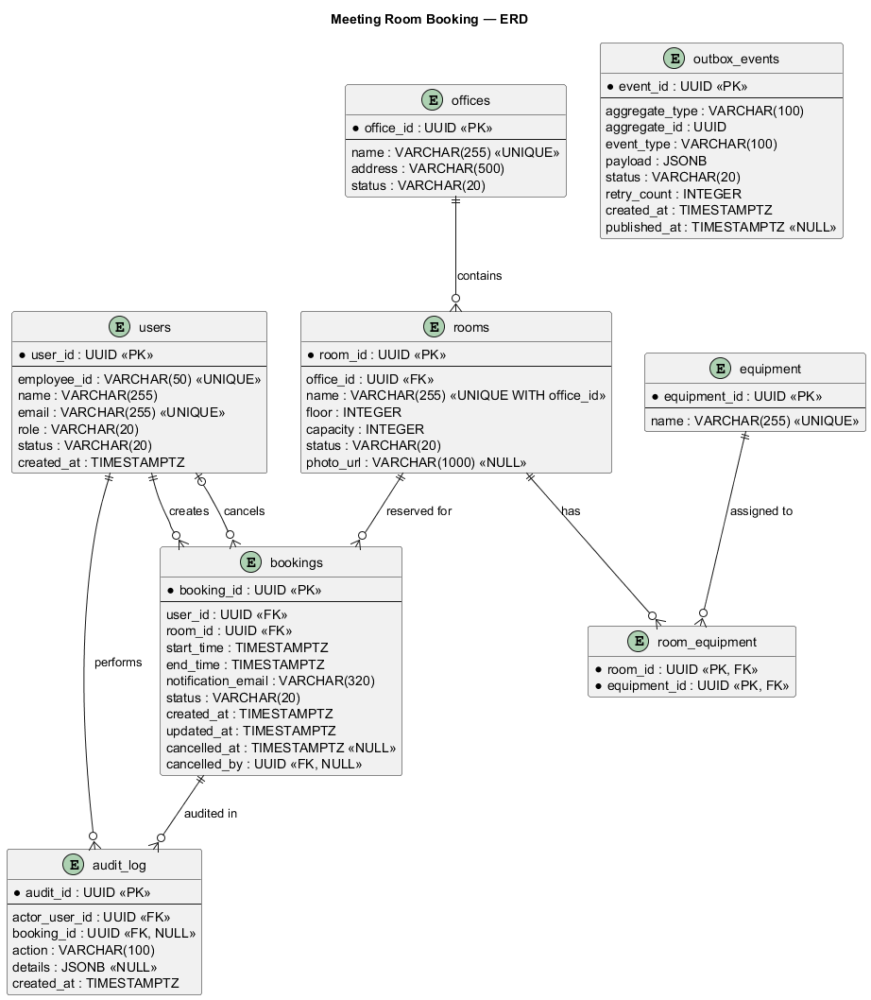
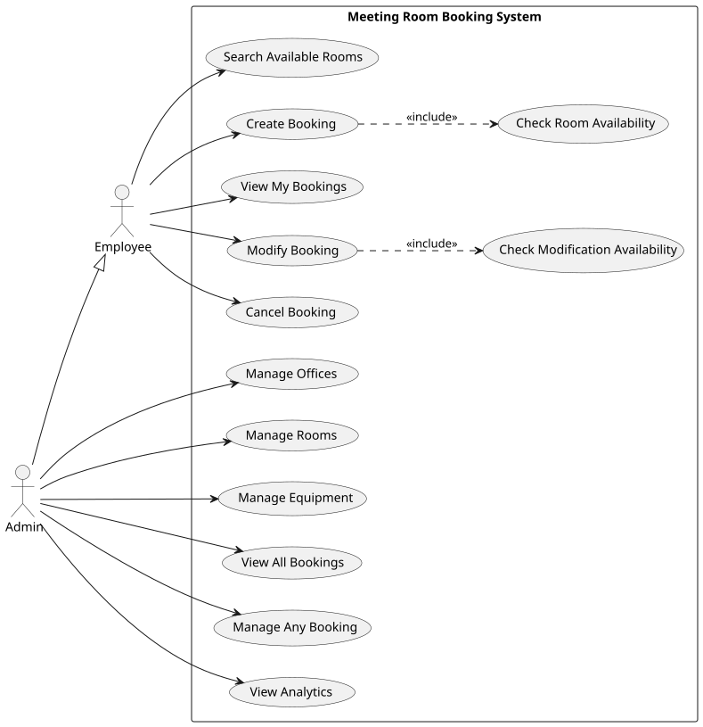
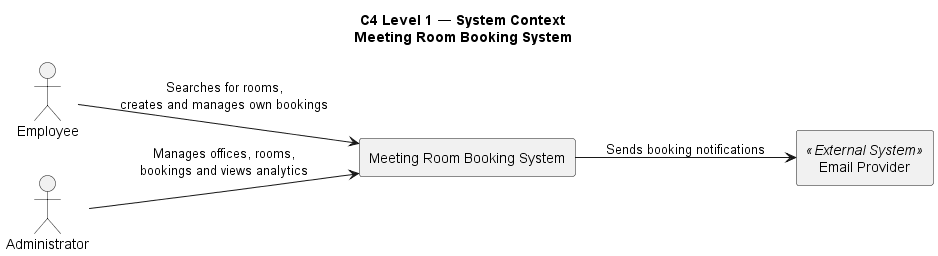
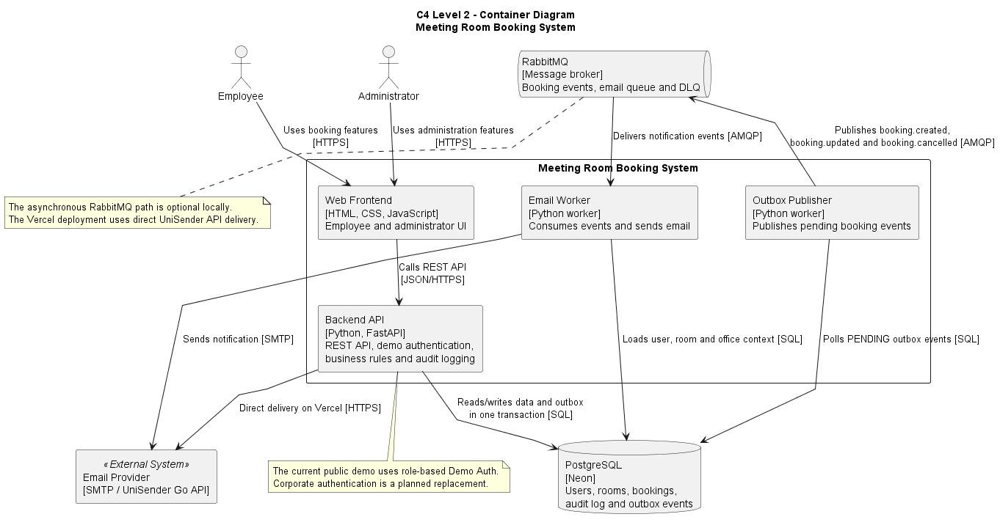
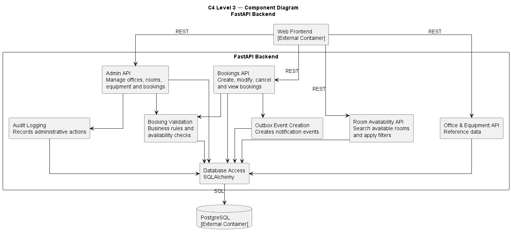

# Meeting Room Booking System

Portfolio project focused on system analysis, architecture design and implementation of an internal meeting room booking system.

The system allows employees to search for available meeting rooms, create and manage bookings, while administrators can manage offices, rooms and bookings.

## Project Goal

Design a reliable internal web service that provides a unified meeting room booking process, prevents conflicting reservations and supports reliable asynchronous notifications.

## Key Features

### Employee
- Search available rooms by office, date and time
- Filter rooms by capacity and equipment
- Create meeting room bookings
- Choose a notification email for each booking
- Modify and cancel own bookings
- View current and historical bookings
- Receive email notifications

### Administrator
- View and manage all bookings
- Manage offices, rooms and equipment
- Activate and deactivate rooms and offices
- View basic booking analytics
- Perform administrative actions recorded in the audit log

## Core Business Rules

- Minimum booking duration: 15 minutes
- Maximum booking duration: 4 hours
- Booking time step: 15 minutes
- Bookings can be created up to 30 calendar days in advance
- A booking cannot cross a calendar day
- Employees can modify or cancel a booking no later than 30 minutes before it starts
- Exactly 30 minutes before start is allowed
- Overlapping ACTIVE bookings for the same room are prohibited
- Adjacent bookings are allowed
- Administrators are not restricted by the 30-minute rule
- INACTIVE rooms and offices cannot receive new bookings
- Historical bookings are retained
- Email delivery failure does not invalidate a booking

## Architecture

The solution combines synchronous REST operations with asynchronous event processing.

Main components:

- FastAPI Backend
- PostgreSQL
- Transactional Outbox
- Outbox Publisher
- RabbitMQ
- Email Worker
- SMTP Service
- Responsive web frontend served by FastAPI
- Demo Auth role selector designed to be replaced by Corporate Auth

Notification flow:

`FastAPI -> PostgreSQL (Booking + Outbox Event) -> Outbox Publisher -> RabbitMQ -> Email Worker -> SMTP`

The booking and its Outbox Event are stored in the same database transaction.

If RabbitMQ or the email service is temporarily unavailable, the booking itself remains valid.

## Reliability and Concurrency

The project covers:

- Database-level prevention of overlapping ACTIVE bookings
- Concurrent booking requests
- Transactional Outbox
- RabbitMQ acknowledgements
- Dead Letter Queue
- Backend and database failure scenarios
- Duplicate message delivery scenarios

Target improvements include API idempotency, optimistic locking, persistent consumer deduplication and full retry/backoff.

See `docs/Edge_Cases_and_Concurrency.md`.

## API

Base path:

`/api/v1`

Main employee operations:

- `GET /offices`
- `GET /equipment`
- `GET /rooms`
- `GET /rooms/available`
- `POST /bookings`
- `GET /bookings/my`
- `GET /bookings/{booking_id}`
- `PATCH /bookings/{booking_id}`
- `POST /bookings/{booking_id}/cancel`

Administrative operations are available under `/api/v1/admin`.

OpenAPI specification:

`docs/api/openapi.yaml`

Swagger UI when the backend is running:

`http://127.0.0.1:8000/docs`

## Data Model

Main PostgreSQL tables:

- `users`
- `offices`
- `rooms`
- `equipment`
- `room_equipment`
- `bookings`
- `audit_log`
- `outbox_events`

PostgreSQL enforces a database-level exclusion constraint that prevents overlapping ACTIVE bookings for the same room.

Database scripts:

- `database/schema.sql`
- `database/seed.sql`

ERD:

- `docs/uml/ERD.puml`

### Entity Relationship Diagram




## System Analysis Artifacts

### BPMN

- [Create Booking Process](docs/images/BPMN-01_Create_Booking.svg)
- [Modify Booking Process](docs/images/BPMN-02_Modify_Booking.svg)
- [Cancel Booking Process](docs/images/BPMN-03_Cancel_Booking.svg)

Editable BPMN source files are located in `docs/bpmn`.
### UML

#### Use Case Diagram



Sequence diagrams:

- [Create Booking](docs/images/Sequence_Create_Booking.svg)
- [Modify Booking](docs/images/Sequence_Modify_Booking.svg)
- [Cancel Booking](docs/images/Sequence_Cancel_Booking.svg)

PlantUML source files are located in `docs/uml`.
### C4 Architecture
Located in `docs/uml`:

- `C4_Context.puml`
- `C4_Container.puml`
- `C4_Component_Backend.puml`

### C4 System Context



### C4 Container Diagram



### C4 Backend Component Diagram



### Edge Cases and Concurrency

`docs/Edge_Cases_and_Concurrency.md`

## Requirements and Traceability

The project includes:

- Business and User Requirements
- Functional and Non-Functional Requirements
- Business Rules
- Use Cases
- User Stories and Acceptance Criteria
- BPMN and UML models
- API contracts
- Data model
- Jira backlog and traceability

Example traceability chain:

`Requirement -> Business Rules -> Use Case -> User Story -> BPMN -> API -> Database -> Implementation`

## Jira

The Jira backlog uses the hierarchy:

`Epic -> Story -> Subtask`

Main Epics:

- Booking Management
- Room Search
- Administration
- Notifications & Integrations
- Authentication & Access Control

## Documentation

Detailed system analysis documentation is maintained in Confluence:

[Meeting Room Booking System — Confluence](https://nickmartirosian.atlassian.net/wiki/spaces/~7120203dbcadf5228842f2977d66dce65736de/pages/458753/Meeting+Room+Booking+System)

## Technology Stack

- Python
- FastAPI
- SQLAlchemy
- PostgreSQL
- RabbitMQ
- SMTP
- OpenAPI / Swagger
- Postman
- PlantUML
- Camunda Modeler
- Jira
- Confluence
- Git / GitHub
- Docker

## Prototype Status

Implemented:

- PostgreSQL schema and seed data
- Room search
- Booking creation, modification and cancellation
- Booking business-rule validation
- Database protection against overlapping bookings
- Administrative API
- Audit logging
- Transactional Outbox
- RabbitMQ integration
- BookingCreated / BookingUpdated / BookingCancelled events
- Email recipient snapshots stored per booking and included in every booking event
- Email Worker and SMTP delivery
- Dead Letter Queue
- OpenAPI documentation
- Postman collection
- BPMN, UML and C4 diagrams
- Edge-case and concurrency analysis
- Jira backlog and traceability
- Responsive employee and administrator web applications
- Demo Auth without public registration
- Employee search, booking, rescheduling, cancellation and history
- Admin booking registry, resource management and analytics dashboard

## How to Run

## Production deployment with Docker

The production stack is defined in `docker-compose.prod.yml` and includes the
FastAPI application, PostgreSQL, RabbitMQ, the outbox publisher, the email
worker, and Caddy for automatic HTTPS.

1. Copy `.env.production.example` to `.env.production` on the server.
2. Replace every placeholder with production-only secrets. Never commit
   `.env.production`.
3. Point the `A` records for `meetingsystem.ru` and `www.meetingsystem.ru` to
   the server's public IPv4 address.
4. Start the stack:

   ```bash
   docker compose --env-file .env.production -f docker-compose.prod.yml up -d --build
   ```

5. Verify `https://meetingsystem.ru/api/v1/health` and review service status:

   ```bash
   docker compose --env-file .env.production -f docker-compose.prod.yml ps
   ```

Caddy obtains and renews TLS certificates automatically after DNS points to
the server and inbound ports 80 and 443 are open.

### 1. Clone the repository

```bash
git clone https://github.com/e2ali2/meeting-room-booking-system.git
cd meeting-room-booking-system
```

### 2. Create Python virtual environment

```bash
cd backend
python -m venv .venv
```

Activate it on Windows:

```bash
source .venv/Scripts/activate
```

### 3. Install dependencies

```bash
pip install -r requirements.txt
```

### 4. Configure environment

Copy `.env.example` to `.env` and provide your local PostgreSQL and SMTP credentials.

### 5. Prepare PostgreSQL

Create the `meeting_room_booking` database and execute:

- `database/schema.sql`
- `database/seed.sql`

The project currently creates its database from scratch, so `schema.sql` is the
single source of truth and matches the ERD in `docs/uml/ERD.puml`.

The booking form pre-fills the demo user's email but allows a visitor to enter
their own notification address. That address is validated, stored with the
booking and reused for created, updated and cancelled notification events.

### 6. Start the API

From the `backend` directory:

```bash
uvicorn app.main:app --reload
```

Swagger UI:

`http://127.0.0.1:8000/docs`

Web application:

`http://127.0.0.1:8000/`

The landing page offers two demo identities: Employee and Administrator. Demo
Auth is enabled by `DEMO_AUTH_ENABLED=true`; it resolves seeded users and sends
no credentials to the browser. Set `DEMO_EMPLOYEE_ID` to select another seeded
employee. This adapter is intentionally isolated so it can be replaced with
corporate OIDC/JWT authentication for production.

For a separately hosted frontend, add its origin to the comma-separated
`CORS_ORIGINS` value. The default same-origin deployment needs no extra setup.

### 7. Optional: asynchronous notifications

RabbitMQ is required for asynchronous email notifications.

Run the Outbox Publisher and Email Worker separately after RabbitMQ is available.

## Repository Structure

```text
meeting-room-booking/
├── backend/
│   └── app/
│       ├── routers/
│       └── workers/
│   └── frontend/
│       ├── assets/
│       └── index.html
├── database/
│   ├── schema.sql
│   └── seed.sql
├── docs/
│   ├── api/
│   ├── bpmn/
│   ├── uml/
│   └── Edge_Cases_and_Concurrency.md
├── postman/
├── README.md
└── .gitignore
```
